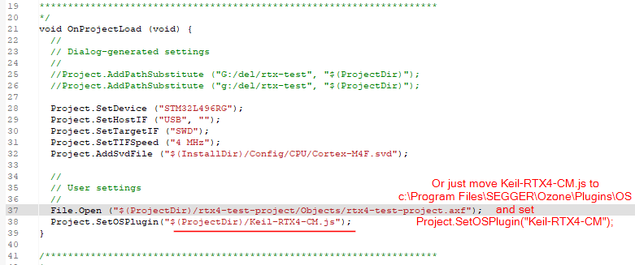
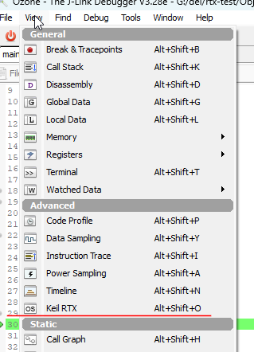
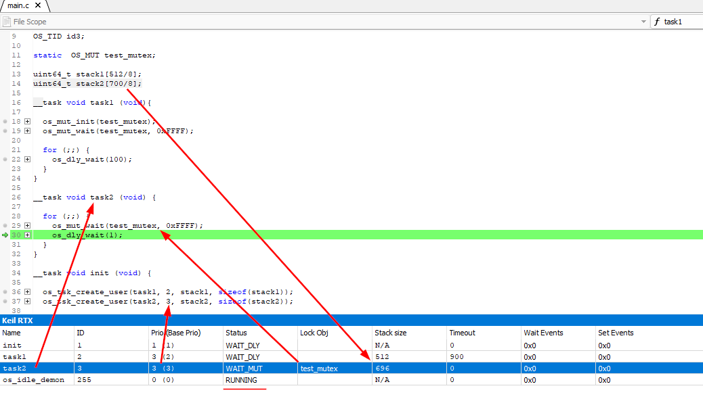

# Segger Ozone Plugin OS RTX4

Segger Ozone does not have support for RTX4 from the package. This is understandable because RTX4 is old version but sometimes need to debug some old projects and OS plugins are really useful stuff

## Setup
Move Keil-RTX4-CM.js file to Ozone project folder and set the path
```
Project.SetOSPlugin("$(ProjectDir)/Keil-RTX4-CM.js");
```


For global scope, move Keil-RTX4-CM.js to Ozone install folder(c:\Program Files\SEGGER\Ozone\Plugins\OS)
```
Project.SetOSPlugin(Keil-RTX4-CM");
```





Enable it by View menu





Enjoy




#
Best Regards,<br>
Dennis K
